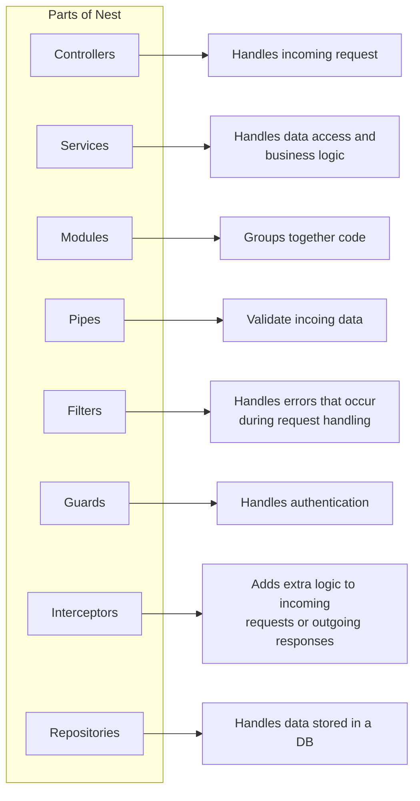
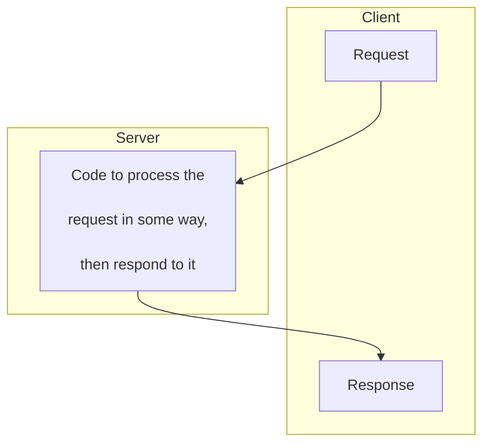
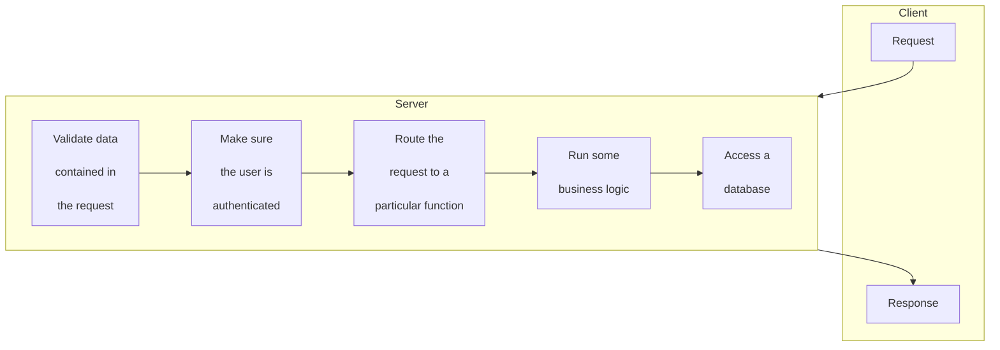
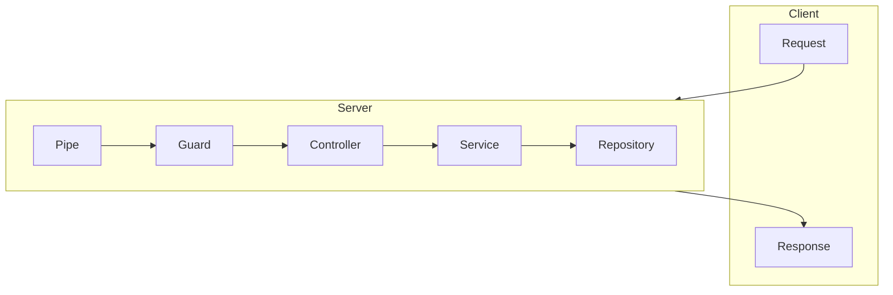

<!--MERMAID {width:100}-->

<!--MCONTENT {content: "graph LR \nsubgraph Parts of Nest \ndirection TB \nControllers \nServices \nModules \nPipes \nFilters \nGuards \nInterceptors \nRepositories \nend \nControllers\\-\\-\\>r1\\[\"Handles incoming request\"\\] \nServices\\-\\-\\>r2\\[\"Handles data access and \nbusiness logic\"\\] \nModules\\-\\-\\>r3\\[Groups together code\\] \nPipes\\-\\-\\>r4\\[Validate incoing data\\] \nFilters\\-\\-\\>r5\\[\"Handles errors that occur \nduring request handling\"\\] \nGuards\\-\\-\\>r6\\[Handles authentication\\] \nInterceptors\\-\\-\\>r7\\[Adds extra logic to incoming \nrequests or outgoing responses\\] \nRepositories\\-\\-\\>r8\\[Handles data stored in a DB\\] "} --->

 

## Create a Nest Module and a Controller

So in just about every Http server you're ever going to create, you're going to have what is referred to as a request response cycle

 

 

<!--MERMAID {width:50}-->

<!--MCONTENT {content: "flowchart TB\n\nsubgraph Client\n\ndirection TB\n\nRequest\n\nResponse\n\nend \nRequest\\-\\-\\>Code\\[\"Code to process the\n\nrequest in some way,\n\nthen respond to it\"\\]\\-\\-\\>Response\n\nsubgraph Server\n\nCode\n\nend"} --->

 

You're going to have some amount of code that's going to process that request, you might validate some data inside the request, you might handle the request differently depending upon what route it is addressed to, and then, eventually you're going to formulate a response and send it back to whoever made the request.

 

 

<!--MERMAID {width:100}-->

<!--MCONTENT {content: "graph\n\nsubgraph Client\n\nRequest\n\nResponse\n\nend\n\nsubgraph Server\n\ns1\\[\"Validate data\n\ncontained in\n\nthe request\"\\]\\-\\-\\>s2\\[\"Make sure\n\nthe user is\n\nauthenticated\"\\]\\-\\-\\>s3\\[\"Route the\n\nrequest to a\n\nparticular function\"\\]\\-\\-\\>a4\\[\"Run some\n\nbusiness logic\"\\]\\-\\-\\>a5\\[\"Access a\n\ndatabase\"\\]\n\nend\n\n \n\nRequest\\-\\-\\>Server\n\nServer\\-\\-\\>Response"} --->

 

Doesn't really matter what language framework, anything that you're using, just about every server is going to have the same series of steps.

So in Nest we have tools to help us create something called:

*   **Pipe**: Help us validate data on incoming request;

*   **Guards**: Make sure that incoming request are coming from users who are authenticated or authorized to use our application;

*   **Controllers**: Controllers contain routing logic;

*   **Service**: Where contain business logic;

*   **Repository**: Logic to access the database.

 

<!--MERMAID {width:100}-->

<!--MCONTENT {content: "graph\n\nsubgraph Client\n\nRequest\n\nResponse\n\nend\n\nsubgraph Server\n\ns1\\[Pipe\\]\\-\\-\\>s2\\[Guard\\]\n\ns2\\-\\-\\>s3\\[Controller\\]\n\ns3\\-\\-\\>s4\\[Service\\]\n\ns4\\-\\-\\>a5\\[Repository\\]\n\nend\n\n \n\nRequest\\-\\-\\>Server\n\nServer\\-\\-\\>Response"} --->

 

Others tools of Nest:

 

<!--MERMAID {width:100}-->

<!--MCONTENT {content: "graph LR \nsubgraph Parts of Nest \ndirection TB \nControllers \nServices \nModules \nPipes \nFilters \nGuards \nInterceptors \nRepositories \nend \nControllers\\-\\-\\>r1\\[\"Handles incoming request\"\\] \nServices\\-\\-\\>r2\\[\"Handles data access and \nbusiness logic\"\\] \nModules\\-\\-\\>r3\\[\"Groups together code\"\\] \nPipes\\-\\-\\>r4\\[\"Validate incoing data\"\\] \nFilters\\-\\-\\>r5\\[\"Handles errors that occur \nduring request handling\"\\] \nGuards\\-\\-\\>r6\\[\"Handles authentication\"\\] \nInterceptors\\-\\-\\>r7\\[\"Adds extra logic to incoming \nrequests or outgoing responses\"\\] \nRepositories\\-\\-\\>r8\\[\"Handles data stored in a DB\"\\] "} --->

 

This file was generated by Swimm. [Click here to view it in the app](https://app.swimm.io/repos/Z2l0aHViJTNBJTNBbmVzdGpzLWNvdXJzZSUzQSUzQUFNYXJjb3NDYXN0ZWxv/docs/jt5e99gc).
